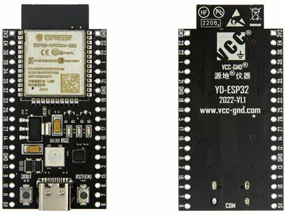
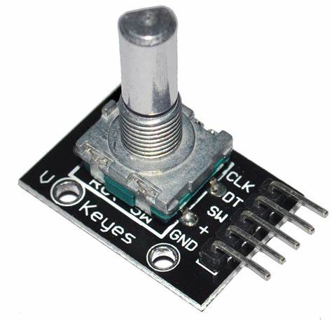
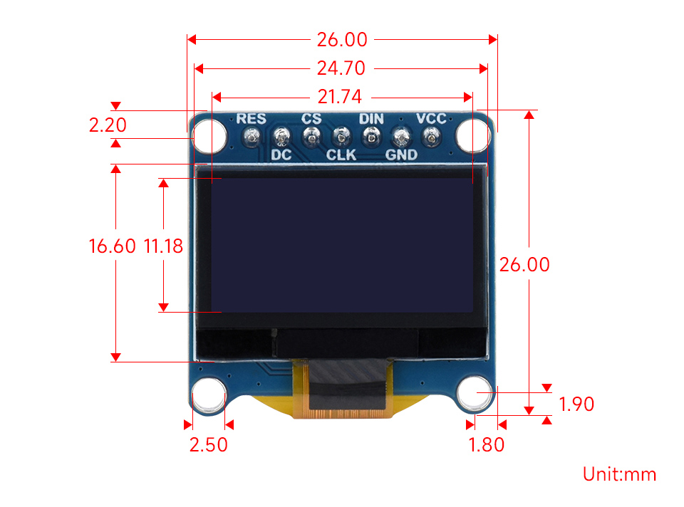

# ISCDisplayMenu

ISCDisplayMenu es un sistema de menú personalizable para pantallas OLED, compatible con codificadores rotativos.

## Apoya el Proyecto

Esta biblioteca ha sido desarrollada con el objetivo de ofrecer una herramienta útil para proyectos con pantallas OLED y codificadores rotativos. Si este proyecto te resulta útil y quieres ayudarnos a mantenerlo y mejorarlo, considera apoyarnos:

- **Patreon**: [https://patreon.com/iscorporacion](https://patreon.com/iscorporacion)

Tu apoyo nos permite dedicar más tiempo al desarrollo y crear nuevas funciones para la comunidad.

---

## Instalación

### Usando PlatformIO

1. Ve al gestor de librerías en PlatformIO.
2. Busca `ISCDisplayMenu`.
3. Haz clic en instalar.

### Manualmente

1. Clona este repositorio.
2. Copia la carpeta en el directorio `lib/` de tu proyecto PlatformIO.

---

## Métodos Disponibles

### Inicialización y Configuración

- **`ISCDisplayMenu::begin`**
  ```cpp
  void begin(const std::string &menuTitle, const std::string &idleScreenText,
             const std::string &adjustValueTitle = "Ajustar Valor",
             const std::string &adjustValueSubtitle = "Valor: ",
             const std::string &yesNoTitle = "Selecciona: ");
  ```
  Configura el menú, la pantalla de reposo y los textos predeterminados.

  **Parámetros**:
  - `menuTitle`: Título que aparece en el menú principal.
  - `idleScreenText`: Título que aparece en la pantalla de reposo.
  - `adjustValueTitle` *(opcional)*: Título mostrado al ajustar un valor.
  - `adjustValueSubtitle` *(opcional)*: Texto mostrado junto al valor ajustable.
  - `yesNoTitle` *(opcional)*: Título mostrado en opciones de tipo `YES_NO`.

---

### Gestión del Menú

- **`ISCDisplayMenu::addYesNoMenuItem`**
  ```cpp
  void addYesNoMenuItem(const std::string &name, void (*yesAction)(), void (*noAction)() = nullptr,
                        const std::string &yesText = "YES", const std::string &noText = "NO");
  ```
  Agrega un ítem al menú con opciones `YES` y `NO`.

  **Parámetros**:
  - `name`: Nombre del ítem en el menú.
  - `yesAction`: Acción ejecutada al seleccionar `YES`.
  - `noAction` *(opcional)*: Acción ejecutada al seleccionar `NO`.
  - `yesText` *(opcional)*: Texto mostrado para `YES`.
  - `noText` *(opcional)*: Texto mostrado para `NO`.

---

- **`ISCDisplayMenu::addChangeMenuItem`**
  ```cpp
  void addChangeMenuItem(const std::string &name, int value, int minValue, int maxValue, void (*changeAction)(int));
  ```
  Agrega un ítem al menú con un valor ajustable mediante el encoder.

  **Parámetros**:
  - `name`: Nombre del ítem en el menú.
  - `value`: Valor inicial.
  - `minValue`: Valor mínimo permitido.
  - `maxValue`: Valor máximo permitido.
  - `changeAction`: Acción ejecutada cuando el valor cambia.

---

- **`ISCDisplayMenu::addNormalMenuItem`**
  ```cpp
  void addNormalMenuItem(const std::string &name, void (*action)());
  ```
  Agrega un ítem normal al menú que ejecuta una acción.

  **Parámetros**:
  - `name`: Nombre del ítem en el menú.
  - `action`: Acción ejecutada al seleccionar el ítem.

---

- **`ISCDisplayMenu::loop`**
  ```cpp
  void loop();
  ```
  Debe ser llamado continuamente en `loop()`. Gestiona el estado del menú y las interacciones del usuario.

---

### Pantalla de Reposo

- **`ISCDisplayMenu::showMainContent`**
  ```cpp
  void showMainContent(const std::string &text, uint8_t textSize = 1);
  ```
  Muestra contenido centrado en la pantalla de reposo, con el tamaño de texto limitado a un máximo de `3`.

  **Parámetros**:
  - `text`: Texto que se mostrará como contenido principal.
  - `textSize` *(opcional)*: Tamaño del texto, limitado a un máximo de `3`.

  Si se configura un subtítulo con `setIdleScreenSubtext`, este será mostrado en la posición especificada (arriba o abajo) sin interferir con el contenido principal.

---

- **`ISCDisplayMenu::setIdleScreenTitle`**
  ```cpp
  void setIdleScreenTitle(const std::string &newTitle);
  ```
  Cambia dinámicamente el título de la pantalla de reposo.

  **Parámetros**:
  - `newTitle`: Nuevo título para la pantalla de reposo.

---

- **`ISCDisplayMenu::setIdleScreenSubtext`**
  ```cpp
  void setIdleScreenSubtext(const std::string &subtext, const std::string &position = "top");
  ```
  Configura un subtítulo adicional para la pantalla de reposo en una posición específica.

  **Parámetros**:
  - `subtext`: Texto que se mostrará como subtítulo.
  - `position` *(opcional)*: Posición del subtítulo. Puede ser `"top"` (arriba) o `"bottom"` (abajo). El valor por defecto es `"top"`.

  **Ejemplo**:
  ```cpp
  menu.setIdleScreenSubtext("Cargando...", "bottom");
  ```

---

### Estado del Menú

- **`ISCDisplayMenu::isMenuActive`**
  ```cpp
  bool isMenuActive() const;
  ```
  Devuelve `true` si el menú está activo o `false` si está en pantalla de reposo.

---

- **`ISCDisplayMenu::closeMenu`**
  ```cpp
  void closeMenu();
  ```
  Cierra el menú y regresa a la pantalla de reposo.

---

## Ejemplo Básico

```cpp
#include <ISCDisplayMenu.h>

#define ENCODER_PIN_CLK 27
#define ENCODER_PIN_DT 26
#define ENCODER_PIN_SW 25

#define SCREEN_WIDTH 128
#define SCREEN_HEIGHT 64
#define SSD1306_I2C_ADDRESS 0x3C

ISCDisplayMenu menu(ENCODER_PIN_CLK, ENCODER_PIN_DT, ENCODER_PIN_SW, SCREEN_WIDTH, SCREEN_HEIGHT, SSD1306_I2C_ADDRESS);

void setup() {
    Serial.begin(115200);
    menu.begin("Menu Principal", "Pantalla de Reposo");

    menu.addYesNoMenuItem("Reiniciar", []() { ESP.restart(); }, []() { Serial.println("Reinicio cancelado"); });
    menu.addChangeMenuItem("Brillo", 5, 1, 10, [](int value) { Serial.print("Nuevo brillo: "); Serial.println(value); });
    menu.addNormalMenuItem("Cerrar", []() { menu.closeMenu(); });

    menu.showMainContent("Bienvenido", 2);
    menu.setIdleScreenSubtext("Cargando...", "top");
}

void loop() {
    menu.loop();
}
```

---

## Ejemplo: Modificar la Pantalla de Reposo

Puedes cambiar dinámicamente el contenido mostrado en la pantalla de reposo. Aquí tienes un ejemplo:

```cpp
#include <ISCDisplayMenu.h>

#define ENCODER_PIN_CLK 27
#define ENCODER_PIN_DT 26
#define ENCODER_PIN_SW 25

#define SCREEN_WIDTH 128
#define SCREEN_HEIGHT 64
#define SSD1306_I2C_ADDRESS 0x3C

ISCDisplayMenu menu(ENCODER_PIN_CLK, ENCODER_PIN_DT, ENCODER_PIN_SW, SCREEN_WIDTH, SCREEN_HEIGHT, SSD1306_I2C_ADDRESS);

void setup() {
    Serial.begin(115200);
    menu.begin("Menu Principal", "Pantalla Inicial");

    menu.showMainContent("Bienvenido", 2); // Mostrar mensaje inicial

    delay(5000); // Espera 5 segundos

    menu.setIdleScreenTitle("Nuevo Título"); // Cambiar el título de la pantalla de reposo
    menu.setIdleScreenSubtext("Listo", "bottom");
    menu.showMainContent("Hecho", 1); // Mostrar nuevo contenido
}

void loop() {
    menu.loop();
}
```

Este ejemplo muestra cómo actualizar el contenido, título y subtítulo de la pantalla de reposo durante la ejecución.

---

## Hardware Compatible
Usa estos componentes para hacer pruebas, no significa que solo funcione con ellos. 

### ESP32


### Encoder Rotativo


### Pantalla OLED


